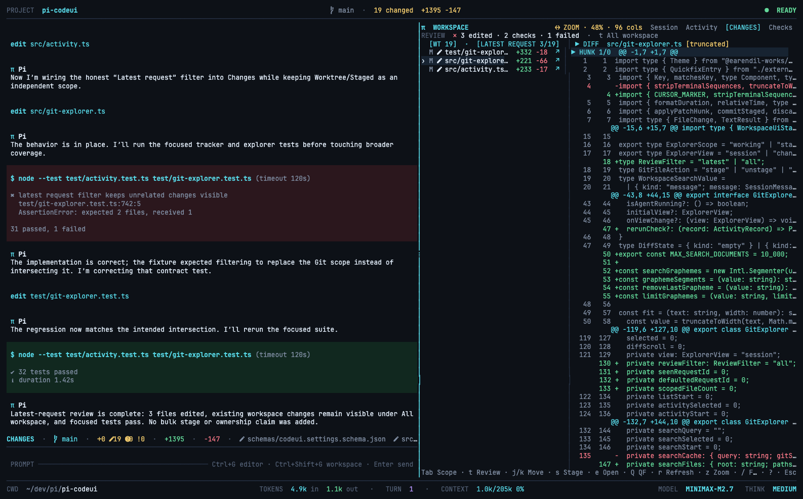

# pi-codeui

[](https://github.com/alpertarhan/pi-codeui/actions/workflows/verify.yml)
[](https://www.npmjs.com/package/pi-codeui)
[](./package.json)
[](https://pi.dev)
[](./LICENSE)

**A conversation-first, code-aware terminal workspace for [Pi Coding Agent](https://pi.dev).**

Keep chat central while Git changes, tool activity, checks, repository search, session resources, and Vim/Neovim workflows stay visible in a keyboard-first rail.



> Actual fullscreen TUI capture. Content, colors, spacing, and available tabs vary by session, terminal, installed extensions, repository, and host theme. An older [clean fullscreen capture](./docs/screenshots/pi-codeui-fullscreen.png) is also available.

## Why pi-codeui?

- **Session-first:** each conversation opens on its overview, including reliable resources and turn/image/action counts.
- **Code-aware:** changed files include separate Worktree/Staged line stats, diffs, diagnostics, safe Git actions, and exact editor navigation.
- **Review-focused:** Changes can show all workspace changes or only files successfully changed by direct `edit`/`write` calls in the latest request, with its edit/check/failure summary.
- **Resumable:** Activity and Checks hydrate completed tool history when a session is resumed.
- **Repository-wide search:** search messages, Activity, Checks, every tracked file, and non-ignored untracked files—not only changed files.
- **Terminal-native:** keyboard/mouse controls, responsive layouts, IME-safe grapheme input, Unicode/ASCII fallbacks, and Pi theme tokens.
- **Fail-closed:** destructive or compatibility-sensitive actions are guarded, confirmed, or disabled when safety is uncertain.

The latest-request filter is review scope, not an ownership claim. It includes only successful direct `edit` and `write` tool results associated with the latest request; Bash changes, manual edits, failed calls, and inferred authorship are excluded.

## Requirements

- Node.js **22.19.0+**
- Pi Coding Agent **0.84.x**
- Git for Changes and repository-file Search; Session, Activity, Checks, and message search also work outside repositories
- Optional Vim or Neovim for external file and quickfix navigation

## Install

```sh
pi install npm:pi-codeui
# or latest GitHub source
pi install git:github.com/alpertarhan/pi-codeui
```

Restart Pi or run `/reload`, then focus the workspace with `/codeui` or `Ctrl+Shift+G`.

CodeUI preserves the active Pi theme by default. The bundled **CodeUI Midnight** theme is recommended but opt-in: select `codeui-midnight` with Pi's `/theme` picker, or set it explicitly in CodeUI settings.

## Workspace

| Surface | Purpose |
| --- | --- |
| **Session** | Conversation title, status, counts, latest-request summary, and reliable resources |
| **Activity** | Newest-first tool history with What, Context, How, Result, status, timing, and Bash timeout in seconds |
| **Changes** | Worktree/Staged files, per-file numstats, Latest/All review scope, diffs, guarded actions, commits, and quickfix |
| **Checks** | Current test/lint/typecheck/build results, parsed diagnostics, and confirmed reruns |
| **Search** | Fuzzy search across messages, repository files, Activity, and Checks; limit controlled by `maxSearchRecords` |
| **Extensions** | Docked compatible Pi widgets such as todo/status components |

The header uses compact `Sess` / `Act` / `Git` / `Chk` labels when space is tight. Footer hints put available actions first. A compact Changes strip remains beside the prompt only while files are dirty.

### Layout and width

With the default `explorer.layout: "split"`, the persistent split is used only in Pi's **fullscreen** TUI at **120 columns or wider** and when the compatible layout capability is available. Otherwise `/codeui` falls back to a right overlay at or above the threshold, or a transient full-width dashboard below it. Explicit `layout: "overlay"` always uses the fallback flow.

Split resizing is workspace-persistent. Review zoom is not: `z` temporarily toggles a 50% rail and resets when focus returns to the prompt, the workspace deactivates, or CodeUI reloads.

## Essential controls

| Key | Scope | Action |
| --- | --- | --- |
| `Ctrl+Shift+G` or `/codeui` | Global | Focus/open workspace |
| `h` / `a` / `g` / `c` | Workspace | Session / Activity / Changes / Checks |
| `/` | Workspace | Search conversation, repository files, Activity, and Checks |
| `m:` / `f:` / `a:` / `c:` | Search | Restrict results to messages / files / Activity / Checks |
| `j` / `k`, arrows | Lists/details | Move selection or scroll |
| `Enter` | Lists/search | Switch list/detail focus or reveal result |
| `e` | Located result | Open in configured external editor |
| `Tab` | Changes | Switch Worktree/Staged |
| `t` | Changes | Toggle latest-request successful edits / all workspace changes |
| `s` | Changes | Stage/unstage selected file or hunk |
| `n` / `p` | Changes diff | Select next/previous hunk |
| `m` / `x` / `C` | Changes | Action menu / confirmed tracked discard / commit staged changes |
| `Q` | Changes/Checks | Open workspace locations in Vim/Neovim quickfix |
| `r` | Checks | Confirm and rerun selected stored check |
| `r` | Other views | Refresh Git state |
| `w` | Workspace | Collapse/expand Extensions dock |
| `[` / `]` / `0` | Fullscreen split only | Shrink / grow / reset persistent rail width |
| `z` | Fullscreen split only | Toggle temporary review zoom |
| `?` | Workspace | Contextual help |
| `Esc` or `q` | Workspace | Return focus to Pi's editor |

Primary actions support mouse selection. Drag the fullscreen divider to resize; double-click it to reset.

Checks rerun only Bash-based test/build/lint records. Before execution, CodeUI displays the sanitized **full** stored command, working directory, and finite timeout (seconds) for confirmation. Approval executes the original untruncated command through the documented shell boundary described under [Safety](#safety-and-compatibility).

## Configuration

Settings merge in order: built-in defaults, global `~/.pi/agent/codeui.settings.json` (respecting `PI_CODING_AGENT_DIR`), then trusted-project `<cwd>/.pi/codeui.settings.json`. Untrusted project settings are ignored. Invalid live edits preserve the last valid settings.

```json
{
  "$schema": "https://unpkg.com/pi-codeui/schemas/codeui.settings.schema.json",
  "appearance": {
    "theme": "inherit",
    "density": "compact",
    "borders": "rounded",
    "glyphPreset": "nerd",
    "fallbackGlyphPreset": "unicode"
  },
  "chrome": {
    "header": true,
    "footer": true,
    "editor": true,
    "messageLabels": true
  },
  "explorer": {
    "layout": "split",
    "splitWidth": "34%",
    "overlayWidth": "52%",
    "minOverlayColumns": 120,
    "dockWidgets": true,
    "maxDockRows": 12,
    "maxSearchRecords": 50
  },
  "vim": {
    "enabled": false,
    "startMode": "insert",
    "externalEditor": ["nvim"]
  }
}
```

`maxSearchRecords` accepts **1–200**. See the complete [`schemas/codeui.settings.schema.json`](./schemas/codeui.settings.schema.json). `/codeui-doctor` reports configuration/trust, glyphs, runtime, terminal viewport, repository, split compatibility, persisted state, Activity, diagnostics, latest-request summary, and editor ownership. There is no `/codeui-settings` command yet; edit the JSON files directly.

### Themes and terminals

`appearance.theme: "inherit"` leaves the host theme untouched. An explicit theme makes CodeUI select it; CodeUI restores the previous host theme only while it still owns that selection, so a later user/extension theme change is preserved. `codeui-midnight` is bundled and opt-in.

Glyph presets are `nerd`, `unicode`, `ascii`, and `custom`. The terminal owns font family, size, ligatures, and rendering; see [`docs/terminal-profiles.md`](./docs/terminal-profiles.md).

Optional Pi host settings for a quieter chat surface belong in `~/.pi/agent/settings.json`, not CodeUI settings:

```json
{
  "quietStartup": true,
  "outputPad": 1,
  "editorPaddingX": 1
}
```

## Vim and Neovim

Embedded Vim mode is optional and deliberately small: Normal mode supports `h/j/k/l`, `w/b`, `0/$`, `x`, `i`, and `a`. Toggle it for the session with `/codeui-vim`.

Pi's native `Ctrl+G` edits the prompt with Pi's configured external editor. CodeUI's `e` and `Q` use direct argv-based `vim.externalEditor` execution, with no shell interpolation of file paths.

## Safety and compatibility

Git and editor operations use direct argv execution and repository-relative validation. Stage/unstage, tracked-file discard, hunk actions, commits, and quickfix export are guarded by current repository state. Discard is blocked for the whole time the agent is active, checked again after confirmation, and unavailable for untracked, renamed, or conflicted files. Unsafe hunk operations fail closed.

The one intentional shell boundary is confirmed Checks rerun: CodeUI stores the original complete Bash validation command, cwd, and optional finite timeout; shows sanitized full values for confirmation; then executes `/bin/bash` (or `bash`) with `-c` and the original raw command. It never executes a truncated display string. Treat rerun approval as approving that shell command.

Established repositories refresh from debounced events and explicit actions rather than idle polling. Only non-repository discovery polls: a low-frequency **30-second** check notices `git init`.

Conversation labels are display-only and do not modify stored messages or take ownership of built-in tools. Pi 0.84 has no public side-panel API, so fullscreen split uses a bounded identity-checked adapter and falls back safely. See [`docs/COMPATIBILITY.md`](./docs/COMPATIBILITY.md).

## Commands

| Command | Purpose |
| --- | --- |
| `/codeui` | Focus/open workspace |
| `/codeui-refresh` | Refresh repository state |
| `/codeui-reset-workspace` | Reset saved width, Git scope, and dock state for this workspace |
| `/codeui-vim` | Toggle embedded Vim mode for this session |
| `/codeui-doctor` | Inspect runtime, configuration, compatibility, and diagnostics |
| `/reload` | Reload Pi extensions/resources |

## Development

```sh
git clone https://github.com/alpertarhan/pi-codeui.git
cd pi-codeui
npm ci
npm run verify
npm pack --dry-run
npm run dev
```

- Architecture and delivery status: [`PRODUCT_PLAN.md`](./PRODUCT_PLAN.md)
- Release history: [`CHANGELOG.md`](./CHANGELOG.md)
- Release checklist: [`docs/RELEASING.md`](./docs/RELEASING.md)
- v1 migration: [`docs/MIGRATION-v1.md`](./docs/MIGRATION-v1.md)

## Contributing

Issues and focused pull requests are welcome. Read [`CONTRIBUTING.md`](./CONTRIBUTING.md), follow the [`CODE_OF_CONDUCT.md`](./CODE_OF_CONDUCT.md), and report vulnerabilities privately per [`SECURITY.md`](./SECURITY.md).

## Scope

pi-codeui does not replace Pi's transcript renderer or become a full IDE. Untracked deletion, conflict/rename discard, multi-line commit bodies, amend/signing, and advanced multi-hunk workflows remain out of scope until they can preserve the fail-closed contract.

## License

[MIT](./LICENSE) © 2026 pi-codeui contributors.
