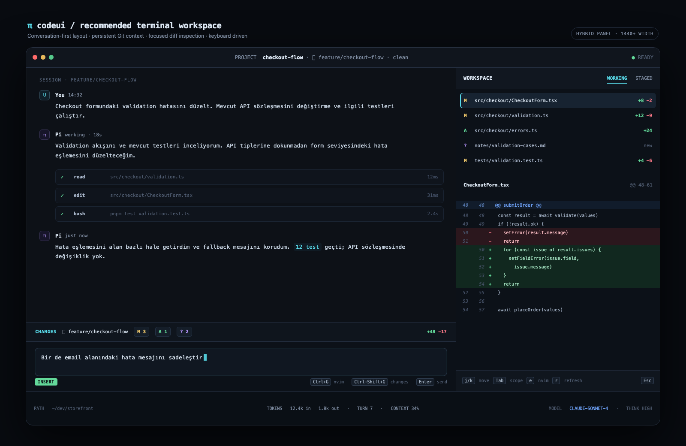

# pi-codeui

[](https://github.com/alpertarhan/pi-codeui/actions/workflows/verify.yml)
[](https://www.npmjs.com/package/pi-codeui)
[](./package.json)
[](https://pi.dev)
[](./LICENSE)

**A conversation-first, code-aware terminal workspace for [Pi Coding Agent](https://pi.dev).**

Keep chat at the center while Git changes, tool activity, checks, search, session resources, and Vim/Neovim workflows stay visible in a keyboard-first side rail.



## Why pi-codeui?

Pi already provides the conversation and agent runtime. pi-codeui adds persistent workspace context without replacing that flow:

- **Session-first:** every conversation opens on a calm overview instead of an empty Git panel.
- **Code-aware:** safe Git actions, diffs, diagnostics, quickfix export, and exact editor navigation appear when relevant.
- **General-purpose:** research, files, exports, decisions, and other tool activity are useful even outside a Git repository.
- **Terminal-native:** keyboard and mouse controls, responsive widths, Unicode/ASCII fallbacks, and native Pi themes.
- **Fail-closed:** destructive or compatibility-sensitive behavior is guarded, confirmed, or disabled when safety is uncertain.
- **Extension-friendly:** compatible Pi widgets can share the rail instead of consuming transcript height.

## Requirements

- Node.js **22.19.0+**
- Pi Coding Agent **0.84.x**
- Git for the Changes workspace; general chat, Activity, Checks, and Search also work outside Git repositories
- Optional: Vim or Neovim for external file and quickfix navigation

## Install

From npm:

```sh
pi install npm:pi-codeui
```

From the latest GitHub source:

```sh
pi install git:github.com/alpertarhan/pi-codeui
```

Restart Pi or run `/reload`, then focus the workspace with:

```text
/codeui
```

Use Pi's `/theme` picker to select the bundled `codeui-midnight` theme if desired.

## Workspace surfaces

| Surface | Purpose |
| --- | --- |
| **Session** | Conversation title, turn/image/action counts, current status, and reliable session resources |
| **Activity** | Newest-first tool timeline with What, Context, How, Result, status, and timing |
| **Changes** | Worktree/Staged files, diffs, guarded Git actions, commits, and quickfix export |
| **Checks** | Latest test, lint, typecheck, and build state with parsed diagnostics |
| **Search** | Unified fuzzy search across messages, files, activity, and checks |
| **Extensions** | Docked compatible Pi widgets such as todo/status components |

The global header shows project/session identity and one agent state. The footer prioritizes working directory, token flow, turn, context pressure, model, and thinking level without duplicating rail content.

## Essential controls

| Key | Action |
| --- | --- |
| `Ctrl+Shift+G` or `/codeui` | Focus/open the workspace |
| `h` / `a` / `g` / `c` | Session / Activity / Changes / Checks |
| `/` | Search messages, files, activity, and checks |
| `m:` / `f:` / `a:` / `c:` | Restrict search to one source |
| `j` / `k` or arrows | Move selection |
| `Enter` | Reveal a search result or switch list/detail focus |
| `e` | Open the selected file/location in the external editor |
| `Tab` | Switch Worktree/Staged scope in Changes |
| `s` | Stage/unstage the selected file or hunk |
| `m` | Open the selected file action menu |
| `x` | Confirm and discard safe tracked worktree changes |
| `C` | Open the guarded staged-change commit composer |
| `Q` | Open workspace locations in native Vim/Neovim quickfix |
| `w` | Collapse/expand the Extensions dock |
| `[` / `]` / `0` | Shrink / grow / reset split width |
| `?` | Contextual workspace help |
| `Esc` or `q` | Return focus to Pi's editor |

Primary actions also support mouse selection. Drag the centered divider to resize it; double-click it to reset the configured width.

## Configuration

Settings are merged in this order, with later valid fields winning:

1. built-in defaults;
2. global: `~/.pi/agent/codeui.settings.json` (respects `PI_CODING_AGENT_DIR`);
3. trusted project: `<cwd>/.pi/codeui.settings.json`.

Project settings are ignored unless Pi marks the project trusted. Unknown or invalid fields warn and inherit the previous valid value; malformed live edits preserve the last valid settings.

Start with the bundled schema:

```json
{
  "$schema": "https://unpkg.com/pi-codeui/schemas/codeui.settings.schema.json",
  "appearance": {
    "theme": "codeui-midnight",
    "density": "compact",
    "borders": "rounded",
    "glyphPreset": "nerd",
    "fallbackGlyphPreset": "unicode"
  },
  "chrome": {
    "header": true,
    "footer": true,
    "editor": true
  },
  "explorer": {
    "layout": "split",
    "splitWidth": "34%",
    "overlayWidth": "52%",
    "minOverlayColumns": 100,
    "dockWidgets": true,
    "maxDockRows": 12
  },
  "vim": {
    "enabled": false,
    "startMode": "insert",
    "externalEditor": ["nvim"]
  }
}
```

The complete schema is [`schemas/codeui.settings.schema.json`](./schemas/codeui.settings.schema.json). `/codeui-doctor` reports configuration/trust, glyphs, runtime, terminal viewport, repository, split compatibility, persisted workspace state, Activity, diagnostics, and editor ownership.

### Appearance and terminal support

pi-codeui uses Pi's native theme tokens rather than maintaining a second color system. `codeui-midnight` is bundled; `inherit` or any installed Pi theme also works.

Glyph presets:

- `nerd` — best with a Nerd Font;
- `unicode` — portable Unicode fallback;
- `ascii` — conservative terminal fallback;
- `custom` — fallback preset plus icon overrides.

The terminal owns font family, size, ligatures, and rendering. See [`docs/terminal-profiles.md`](./docs/terminal-profiles.md) for Ghostty, Kitty, and WezTerm examples.

### Vim and Neovim

Embedded Vim mode is intentionally small and optional. Normal mode supports `h/j/k/l`, `w/b`, `0/$`, `x`, `i`, and `a`; it is not a Vim emulator. Toggle it for the current session with `/codeui-vim`.

Pi's native `Ctrl+G` flow edits the prompt with Pi's configured external editor. Separately, `e` and `Q` suspend the TUI, invoke pi-codeui's direct argv-based `vim.externalEditor`, resume Pi, and refresh Git state. Commands are never constructed through a shell.

## Safety and compatibility

Git operations use direct argv execution and repository-relative validation. Stage/unstage, tracked-file discard, hunk actions, commits, and quickfix export are guarded by the current repository state. Unsupported binary, truncated, untracked, renamed, conflicted, or whitespace-filtered hunk operations fail closed.

Pi 0.84 does not yet expose a public side-panel API. The bounded split adapter uses the compatible fullscreen layout root and falls back to an overlay when that capability is unavailable or has been replaced unexpectedly. See [`docs/COMPATIBILITY.md`](./docs/COMPATIBILITY.md) for the tested extension matrix and ownership contract.

## Commands

| Command | Purpose |
| --- | --- |
| `/codeui` | Focus or open the workspace |
| `/codeui-refresh` | Refresh repository state |
| `/codeui-reset-workspace` | Reset persisted width, Git scope, and dock state for the current workspace |
| `/codeui-vim` | Toggle embedded Vim mode for the current session |
| `/codeui-doctor` | Inspect runtime, configuration, compatibility, and diagnostics |
| `/reload` | Reload Pi extensions and resources |

## Development

```sh
git clone https://github.com/alpertarhan/pi-codeui.git
cd pi-codeui
npm ci
npm run verify
npm pack --dry-run
npm run dev
```

GitHub Actions runs TypeScript, the full Node test suite, and a package-content smoke check on Node.js 22.19.0.

- Architecture and completed milestones: [`PRODUCT_PLAN.md`](./PRODUCT_PLAN.md)
- Release history: [`CHANGELOG.md`](./CHANGELOG.md)
- Release checklist: [`docs/RELEASING.md`](./docs/RELEASING.md)
- v1 migration notes: [`docs/MIGRATION-v1.md`](./docs/MIGRATION-v1.md)

## Contributing

Issues and pull requests are welcome.

- Read [`CONTRIBUTING.md`](./CONTRIBUTING.md) for setup, testing, and review expectations.
- Use the provided [bug report](https://github.com/alpertarhan/pi-codeui/issues/new?template=bug_report.yml) or [feature request](https://github.com/alpertarhan/pi-codeui/issues/new?template=feature_request.yml) templates, or open a blank issue.
- Follow the [`CODE_OF_CONDUCT.md`](./CODE_OF_CONDUCT.md).
- Report vulnerabilities privately according to [`SECURITY.md`](./SECURITY.md).

Small focused fixes do not require a prior issue. Please open an issue before broad UX, architecture, dependency, persistence, or compatibility changes so the direction can be agreed first.

## Scope

pi-codeui intentionally does not replace Pi's transcript renderer or become a full IDE. Untracked deletion, conflict/rename discard, multi-line commit bodies, commit amend/signing, and advanced multi-hunk workflows remain out of scope until they can preserve the same fail-closed contract.

## License

[MIT](./LICENSE) © 2026 pi-codeui contributors.
